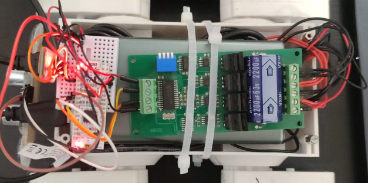
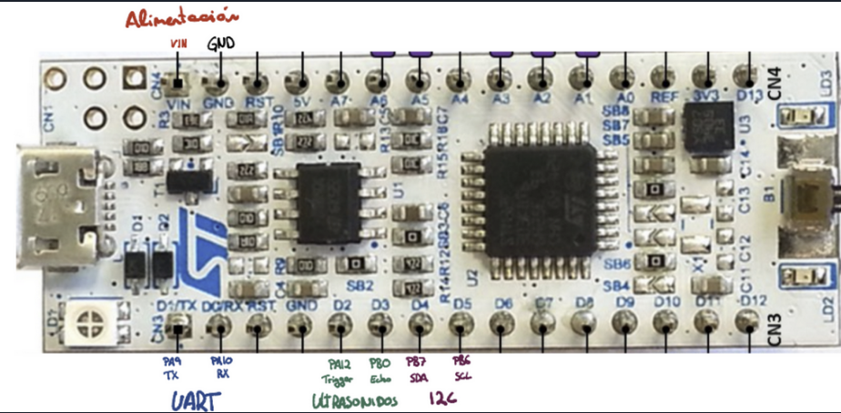

# Fully Functional Car Using STM32F303K8




## Overview

This repository documents a personal project aimed at building a fully functional, microcontroller-driven car. The car leverages the STM32F303K8 microcontroller and integrates various modules and components to ensure precise control and functionality. The car is designed to be controlled via an Android phone using Bluetooth communication.

## Features
- **Microcontroller**: STM32F303K8 for high-performance and efficient control.
- **Communication**: Bluetooth HC-05 module to enable wireless communication with an Android application.
- **Motor Control**: MD-22 motor driver board using the I2C protocol for precise interaction with the motors.
- **Custom Android App**: Provides an intuitive interface to control the car's movements and features.
- **Compact and Modular Design**: Easily extendable for additional functionalities.

## Components Used
1. **STM32F303K8**: The core microcontroller for the project.
2. **HC-05 Bluetooth Module**: To enable Bluetooth communication.
3. **MD-22 Motor Controller**: Facilitates motor control using the I2C protocol.
4. **Motors**: For movement and maneuverability.
5. **Android Device**: Used to control the car via a custom app.
6. **Power Source**: Appropriate power supply to ensure smooth operation.

## System Architecture
1. **Microcontroller (STM32F303K8)**: Acts as the central processing unit, processing input commands and controlling the subsystems.
2. **Bluetooth Communication**: Receives commands from the Android application and relays them to the microcontroller.
3. **Motor Control (MD-22)**: Interacts with the motors via the I2C protocol, providing smooth and accurate movements.
4. **Android Application**: Designed to send commands to the car for navigation and control.

## Circuit Design
Refer to the detailed **blueprint.png** for an overview of the wiring and connections between the components.

## How to Use
### 1. Setup
- Flash the STM32F303K8 microcontroller with the provided firmware.
- Install the custom Android app on your phone.
- Pair the Bluetooth HC-05 module with your Android device.

### 2. Run
- Power up the car.
- Open the Android application and connect to the HC-05 module.
- Use the app to send commands and control the car.

## Prerequisites
- STM32 development environment (e.g., STM32CubeIDE).
- Basic understanding of I2C protocol and Bluetooth communication.
- Android Studio (if you want to customize the Android app).

## Getting Started
1. Clone the repository:
   ```bash
   git clone https://github.com/irunefen/Coche_ADC
   ```
2. Navigate to the project directory and follow the setup instructions.
3. Refer to the documentation in the `docs` folder for detailed guidance.

## Gallery
- **Top View**: 
- **Blueprint**: 

## How It Works 🚗

1. **Main Control Logic (`main.c`)** 🧠:
   - The file contains the core program to control the car.
   - **Initialization ⚙️**:
     - Sets up peripherals like GPIO, UART, I2C, and Timers.
     - Handles Bluetooth communication via the HC-05 module.
   - **Motor Control 🚀**:
     - The function `MD22_SetMotors` sends speed commands to the motors via I2C to the MD-22 motor controller.
     - Speed adjustments are calculated dynamically based on user inputs or environmental conditions.
   - **Obstacle Avoidance 🛑**:
     - The `measure_distance` function uses an ultrasonic sensor to detect obstacles.
     - If an obstacle is closer than 150 mm, the car stops or retreats using `retreat_on_obstacle()`.

2. **Interrupt Handling (`stm32f3xx_it.c`)** ⚡:
   - Handles asynchronous events such as Bluetooth commands or errors.
   - **Bluetooth Commands 📡**:
     - The `USART1_IRQHandler` function processes commands received from the Android app via Bluetooth.
     - Commands like `'w'` for forward, `'s'` for backward, or `'a'`/`'d'` for turning adjust motor speeds accordingly using the `setAction` function.
   - **Command Parsing 🛠️**:
     - A circular buffer processes incoming characters to execute valid motor actions.

3. **User Commands 🎮**:
   - Supported commands include:
     - `'w'`: Move forward.
     - `'a'`: Turn left.
     - `'d'`: Turn right.
     - `'s'`: Move backward.
     - `'m'`: Stop.
     - `'o'`: Rotate counterclockwise.
     - `'k'`: Rotate clockwise.

4. **Peripheral Integration 🔌**:
   - **HC-05 Bluetooth Module**: Communicates wirelessly with the Android app.
   - **MD-22 Motor Driver**: Interacts with the motors using the I2C protocol.
   - **Ultrasonic Sensor**: Measures distances to obstacles.

5. **Safety Features 🛡️**:
   - Obstacle avoidance ensures the car stops or retreats when it detects nearby objects.
   - Built-in error handlers prevent system crashes.

This setup creates a robust, interactive car system ready for remote operation. 🚀 Let me know if you'd like me to add or refine details!

## License
This project is licensed under the MIT License. See the LICENSE file for more details.

## Acknowledgments
- Open-source libraries and tools used.
- Community support and inspiration.

---

Feel free to contribute to the project by submitting issues or pull requests. Happy building!
